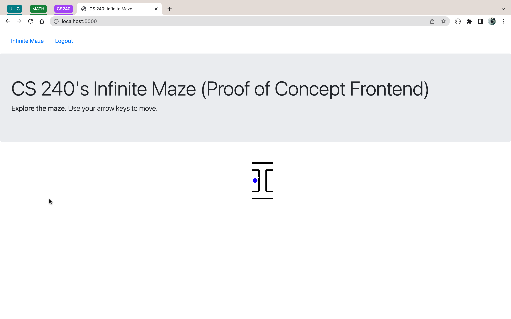
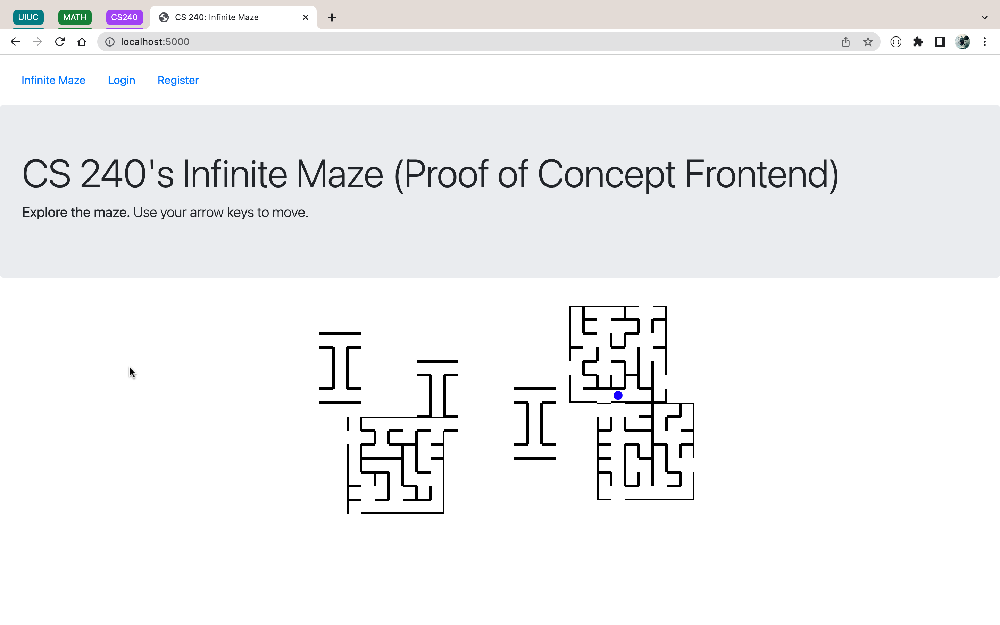

# Infinite Maze API

## Maze Generation

IM Frontend

For logged in users



For logged out users



The following information explains the classes and modules used for this project.

For our backend, we follow an OOP approach to desgin. We have created a base "maze" package containing some helper modules and a "MazeGenerator" base class that all maze generators override.

### maze

- coord.py/Coord
  - A class to represent coordinates or positions in the maze by a row and column
- dir.py/DIR: contains a fixed array of 2-dimensional tuples with useful property:
  - Firstly, the i-th index of the array corresponds with the direction (North/South/East/West) which encodes the i-th bit of the cell in the maze. For example, if a cell has a north wall it might have a value of `0b1000`, which is the hex digit 8. So, the North bit is the third bit of this number. Therefore, NORTH is also the third member of the array. If we know which index of the array the direction is in, we can find out how to encode a cell by simply `1 << i` where i is the index.
  - The actual numbers in the tuple, `(dx,dy)` represent the value that when added to a cell with coordinate `(x,y)` equals to the coordinate `(x+dx,y+dy)` of the new cell, when we take one step in the given DIR (index of the array tells the direction). For example, we are at coord (0,0) and we need to take a step in the EAST direction. EAST is the second element of the array and is equal to (1, 0). So the change in x-direction is 1 and the change in y-direction is 0. The new coordinate after moving 1 cell EAST is `(0,0) + (1,0) = (1,0)`.
- dir.py/get_direction(first,second): A function that accepts two coords and calculates the direction that the second coord is in from the first. The direction will be normalised to a unit value. Assume we only move in 4 directions, N-E-S-W.
- maze.py/Maze
  - A maze class to represent a single maze instance.
  - A maze stores a list of cells. The values of the cell correspond to the walls the cell has i.e. if the 1st element of the list is 0b1000, the cell #1 i.e. the cell at (1,0) has a wall in the North side.
  - The maze also stores the no. of rows and cols as the 'height' and 'width' data member.
  - The list index is mapped to the 2d coord using the bijective function `(row,col) --> row * width + col`, and vice versa: `coord --> (coord // width, coord % width)`.
  - The maze provides functions to add and remove walls from a cell identified by a coordinate (row, column). The set_cell and get_cell functions internally update the encoding of the cell in the array to match with the state of the maze. There are several other functions that are useful, such as the `is_valid_coord` function which checks if a coord is contained in the maze.
  - The encode function can convert the array into an encoded form, that is used by the backend to send as a response.
- mg.py/MazeGenerator:
  - Base class for maze generators.
  - creates a maze instance in the constructor
  - all subclasses override the create() function which returns a maze

## Coordinate System

We will need to setup a way to identify the mazes that have been generated in the "world". For a new user, the blank screen they start with is their world. Their first request they get a 7x7 maze, which has coordinates from (0,0) to (6,6) within itself. However, for the world, this maze is located at (0,0). If the user finds an exit on the East side and attempts to generate the next maze on the right of the current one, the new maze will have a world coordinate of (1,0). In particular there are four cases.

Suppose we are at coordinates `(worldX,worldY)`. The user can take an exit in one of the 4 directions, and these will be the coordinates for the **new** maze.

- NORTH: `(worldX,worldY-1)`
- SOUTH: `(worldX,worldY+1)`
- WEST: `(wordlX-1,worldY)`
- EAST: `(wordlX+1,worldY)`

As you can see, this is similar to the way the coordinates inside the maze work. So, we have a way to store the maze in a database. And we have a way to load a maze from the database, if it exists. This means all users will be able to see the same maze as our middleware will try to fetch a maze for the given worldX, worldY sent alongwith the http request. If one does not exist, our middleware will generate one, through some server, and insert it to the database. So, all mazes in the database will have to store the world coordinates as a field.

## Database and Middleware

We will use a database for our project. Our database will contain the following collections: servers, users, badges and mazes. We choose to use a MongoDB database as it is easily extensible if we want to include more options or fields in some collection.

**Database Name**: cs240-project-maze

Here is a list of schemas for each collection type.

```{}

Server
-------------
{
  _id: ObjectId,
  URL: String,
  status: String,
  accept_size: String,
  owner_name: String,
  owner_email: String,
}

User
-------------
{
  _id: ObjectId,
  name: String,
  email: String,
  username: String,
  password: String,
  geolocation: Object,
  badges: [ ObjectId ],
  stats: {
    mazes_explored: Number
  },
  role: {
    enum: ['user','admin']
  }
}

Badge
-------------
{
  _id: ObjectId,
  title: String,
  description: String,
}

Maze
------------
{
  _id: ObjectId,
  height: Number,
  width: Number,
  geom: [ String ],
  world_x: Number,
  world_y: Number,
  server_id: ObjectId
}
```

Below is a screenshot of the mongo shell displaying the data we currently have:


As you can see wee have two users and two maze generators registered to the db.

## Details

- The Server collection will contain the records for the servers and endpoints for each maze generator that is registered to the database.

  - Each server needs to contain a valid URL that our middleware will request to, for fetching the next maze segment.
  - Furthermore, each server may produce different sized mazes, so they have a field 'accept_size' which contains a list of sizes, encoded as 'row:col', that they can accept. Our middleware will find the right server for each request from the client.
  - The server has a 'status' field which can be 'available' if it is working properly. If there are any issues with the server, or if the server does not output a valid maze/JSON response, our middleware will set the status to 'error'. The 'owner' of this server will be notified about this and the server will not be used again till the status has been updated with some kind of 'admin' access.
  - Specifically, the accept size will store a comma separated list of sizes in the format "wdith":"height" (ex. "7:7,8:8") where each pair is separated by a colon as shown. Furthermore, if the rows or columns are set to a wildcard like \*, then that means the maze generator can produce a maze with any size. Ex. '\*:\*' means that any row and any column is okay.
  - In the future, we can add the "busy" status in case a server is facing a high load. In that case, we can store a "last_access" datetime key in the schema. Then, we can check if the time the server was last accessed was over some value, we can retry that server. Or we can split the servers by location and change that on a daily basis, to balance the load. The users will still see the server results as the final data is going to be persistent on this website.

- The User collection will contain the records for the users and their credentials. Of course, this requires that a user be authenticated in order to access these features. A guest user (not authenticated) can still see the maze segments on our website, however, there progress will not be saved to the database. It would be recommended that everyone sign in to play!
  - The name,email,password,username are standard credentials. We can fetch this information from the user's social media profile, if the user is able to sign in with a social media account, such as Google (Oauth).
  - The geolocation is an important field that we must store for now. It is not implemented aywhere, but in the future we may need this data to scale our app. For example, we can have different servers that serve a particular location only. For this scaling, we have a few options. We can choose to show the same maze segments to everybody in a particular geo region, as coordinating the maze segments across hundreds of servers will slow down the app and our number of requests are expected to increase exponentially.
  - The stats field is used to track certain user progress such as the number of mazes they have explored. As the user is authenticated, we can update their profile on each http request accordingly.
  - The badges feature is used to store achievements of the user. (More on this later). This feature is only for engagement and community.
  - We will also track the last known location for every user, so that they can continue where they left off!
  - The role field will be set to user for most users. The admin role will allow a user to access restricted backend forms where we can edit/delete servers (maze generators).
- The Badge collection contain the details of certain badges that a user can earn and showcase on their profile if they achieve something in the 'game'. For example, there can be a badge for exploring 100 mazes. Thus, we must keep track of user stats in the users collection. We can update and include more stats in the future, as required. The badges and badge earning logic can be customised when this feature is ready.

---

## Middleware Generate Segment

Our middleware does the following validation on each request to `/generateSegment`.

- The middleware gets the list of servers that are currently available for use from the database.
- We search this list to find a server that accepts 7x7 maze sizes and make a get request to the server. It returns a JSON response with the key "geom" containing the data for the maze. The data encoding is still the same. We have a list of "7" strings that each contain "7" hex digits. Each of those hex digits represent the positions of the walls for that cell. The North wall is at position 3, then East, South and West on position 0.
- The middleware ensures that this format is followed. If the data is corrupted in any way, we change the status for this server to "error". At this point, we would like to notify the owner of the server that they have a issue. Therefore, we can add a field to the schema to hold owner name and email.
- If all is okay, the request is forwarded to the frontend where it is rendered for the end user.
- To ensure randomness to the maze generation, we manage a list of servers locally. While the list is not empty, we pull out a random server from this list and remove it from the list. We use this server to produce the maze, if it is valid (or try another). Once we exhaust this list, we fetch all available servers from the db again.

## Middleware Additions

- We are currently developing a form for Server registration. Currently, this is a manual process, as we update the server data within the Mongo Shell. We want to create this form for everyone to add their maze generators to our database. In our middleware we will make a validation check by requesting a sample maze segment from this new server. If it follows the format correctly and does not throw a error, we can proceed to add it to the database. This will take care of spam servers being added. We do need to increase security on this route as people could add any kind of URL that can contain malware.
- A complementary page we are also developing is the /servers page that will display all of the servers in the database. This will be like a Admin page where we can quickly make changes to the servers such as EDIT and DELETE. We will add a middleware route to view this page but it will only allow users if they have the correct 'user role'.

Demo server page


## Authentication

- We currently have a simple system for authentication. We have two forms: one for registering a new user and the other to login. Both forms have corresponding middleware routes to create/fetch users. We also initialise a Flask session to store the user id and the 'logged_in' variable so that we can display different kind of frontend for users.
- Our middleware handles validation of data for the /login and /register forms. In particular we check for the following conditions:
  - Login
    - We check if all the form fields are filled
    - We check if a user exists with the given username
    - If not, we check if a user exists with email is equal to the given username
    - If yes, we check if the passwords match, when hashed to md5
    - On success, we login the user and save their data in our session
  - Register:
    - We check if all the form fields are filled
    - We check if the username contains only alphanumeric and underscore
    - We check if the email matches our predefined regex pattern
    - We check if the password is longer than 3 characters
    - We check if there is no user with the given username (They must be unique)
    - Finally we create the account and save the session data.

Login Form


Register Form


## Frontend Changes

- To accomodate authentication and the addition of several new pages, we decided to use Jinja templates. We defined a 'base.html' file with the page layout and copied the style tag from the original 'index.html' into 'base.html'.
- We added a jinja-block called container in the html body in our 'base.html' file, within a div.container tag. This is where all the content will be placed. The 'base.html' file also container the header, links, external styles, and a simple nav.
- The 'index/html' now extends the base.html file and injects its content in the block we defined.
- Our other html pages follow the same approach, where we extend the base file and surround the code in the block tags. We are also able to use jinja syntax to display information sent from the flask app. For logged in users we show a logout link on the nav while for the other users we show a 'login' and 'register' link! The flask session lets us do this.
- We further organised the project structure and created a 'static' directory in the root directory for all css, javascript files. We added a favicon folder to show a CS240 favicon on the website too! We used the Flask 'url_for' function to link to all the static files in our templates.
  - static/styles/index.css: stylesheet
  - static/js/index.js: javascript
  - static/favicon_io: favicon and webmanifest

## More Features

- The frontend is not sending back any data as of now. We would like to keep track of the users real location on the maze and also have some kind of authentication so we can remember where the user last was in the maze.
- We want to be able to access the coordinate of the exit of the maze from the frontend and attach that to the request we make for the new maze segment. If we can do that, we can ensure that our new maze segment always has an entrace at the same spot the last maze had an exit. We can manually configure the entraces and exits in the middleware. As we can import the maze class into the app. We can add a function in our maze class to **decode** our maze and convert it into a maze object, so that our middleware can make changes to it. Currently, we add random exits in the ranom-maze-generator and the letter-maze is degined to be open from all sides. However, the frontend does not look good and it would be more pleasing to see the mazes start and end at the correct places, instead of random ones.
- The middleware should accept maze data and user data from the frontend on each request to update the required information in the database.
