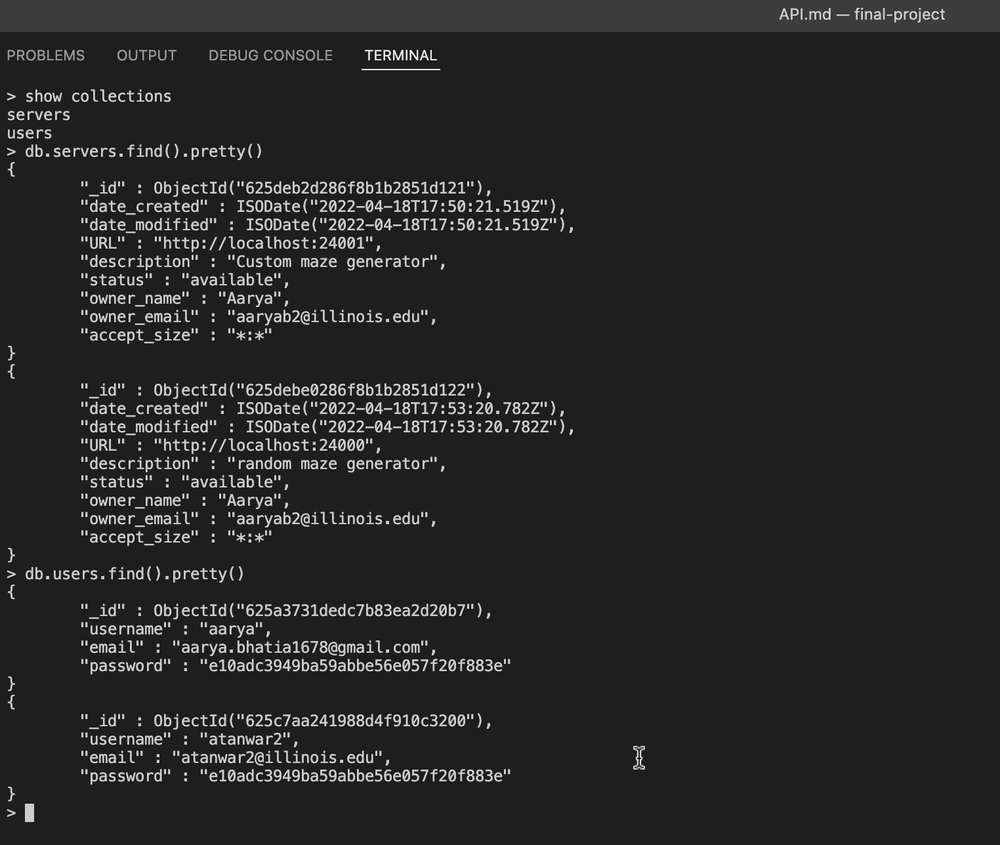
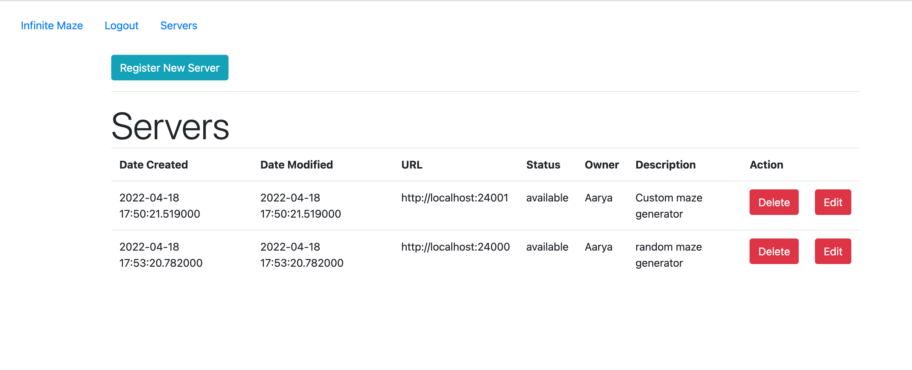
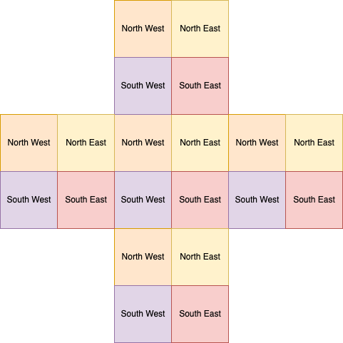

# Infinite Maze API

## Maze Generation


Learn more about the maze generators and the maze modules here: [Maze Documentation](MG.md)

## Database and Middleware

We will use a database for our project. Our database will contain at least the following collections: servers, users, mazes and badges. We choose to use a MongoDB database as it is easily extensible if we want to include more fields in a collection.

**Database Name**: cs240-project-maze

Here is a list of schemas for each collection type.

```{}

Server
-------------
{
  _id: ObjectId,
  URL: String,
  status: String,
  accept_size: String,
  owner_name: String,
  owner_email: String,
  description: String,
  date_modified: Date,
  date_created: Date
}

User
-------------
{
  _id: ObjectId,
  name: String,
  email: String,
  username: String,
  password: String,
  geolocation: {
    latitude: Number,
    longitude: Number,
    /* ...more... */
  }
  badges: [ ObjectId ],
  stats: {
    mazes_explored: Number,
    /* ...more... */
  },
  role: {
    enum: ['user','admin'],
    default: 'user'
  },
  world_location: {
    x: Number,
    y: Number
  },
  maze_location: {
    x: Number,
    y: Number
  }
}

Maze
------------
{
  _id: ObjectId,
  height: Number,
  width: Number,
  geom: [ String ],
  world_x: Number,
  world_y: Number,
  server_id: ObjectId
}

Badge
-------------
{
  _id: ObjectId,
  title: String,
  description: String,
}

```

Below is a screenshot of the mongo shell displaying the data we currently have:



As you can see wee have two users and two maze generators registered to the db.

## Details

### Server Collection

The Server collection will contain the records for the servers and endpoints for each maze generator that is registered to the database.

- Each server needs to contain a valid URL that our middleware will request to, for fetching the next maze segment.
- Furthermore, each server may produce different sized mazes, so they have a field 'accept_size' which contains a list of sizes, encoded as 'row:col', that they can accept. Our middleware will find the right server for each request from the client.
- The server has a 'status' field which can be 'available' if it is working properly. If there are any issues with the server, or if the server does not output a valid maze/JSON response, our middleware will set the status to 'error'. The 'owner' of this server will be notified about this and the server will not be used again till the status has been updated with some kind of 'admin' access.
- Specifically, the accept size will store a comma separated list of sizes in the format "wdith":"height" (ex. "7:7,8:8") where each pair is separated by a colon as shown. Furthermore, if the rows or columns are set to a wildcard like \*, then that means the maze generator can produce a maze with any size. Ex. '\*:\*' means that any row and any column is okay.
- In the future, we can add the "busy" status in case a server is facing a high load. In that case, we can store a "last_access" datetime key in the schema. Then, we can check if the time the server was last accessed was over some value, we can retry that server. Or we can split the servers by location and change that on a daily basis, to balance the load. The users will still see the server results as the final data is going to be persistent on this website.
- Lastly, the date_modified and date_created are timestamp fields which are updated by our middleware on form submit from the frontend (More on this later).

### User Collection

The User collection will contain the records for the users and their credentials. Of course, this requires that a user be authenticated in order to access these features. A guest user (not authenticated) can still see the maze segments on our website, however, there progress will not be saved to the database. It would be recommended that everyone sign in to play.

- We save standard user information such as username,email and password. Currently we have simple authentication page (described later). We can also fetch this information from the user's social media profile, if we choose to use a service such as Google Oauth. We can use an Amazon S3 bucket to store user profile pictures too.
- The geolocation is an important field that we have added. It is not implemented yet, but in the future we may need this data to scale our app. For example, we can have different servers that serve a particular location only. For this we have a few options. We can choose to show the same maze segments to everybody in a particular region, as synchronising the mazes across many different servers will slow down the app and the number of requests to our servers would be increasing exponentially.
- The stats field will be used to track certain user progress such as the number of mazes they have explored. As the user is authenticated, we can update their profile on each http request accordingly.
- The badges feature is used to store achievements of the user. (More on this later). This feature is only for engagement and community.
- We will also track the last known location for every user, so that they can continue where they left off!
- The role field will be set to user for most users. The admin role will allow a user to access restricted backend forms where we can edit/delete servers (maze generators).
- The location fields can store the last location of the user in our maze and world.

### Maze Collection

The maze collection is not implemented yet, but the way this will work is simple. Each maze that is generated by a server will be added to the database. The coordinates that the top-left corner of the maze will be situated at in the 'world' will be sent to us with the request by the frontend. When we have a way to do this, it will be easy to implement this feature. Our middleware will then make a query in the database to see if there exists a maze segment at the given coordinates. If not, we will use our maze generators to initialise one. This is how we can add persistence to our app!

### Badge Collection

The Badge collection contain the details of certain badges that a user can earn and showcase on their profile if they achieve something in the 'game'. For example, there can be a badge for exploring 100 mazes. Thus, we must keep track of user stats in the users collection. We can update and include more stats in the future, as required. The badges and badge earning logic can be customised when this feature is ready.

---

## Middleware Generate Segment

Our middleware does the following validation on each request to `/generateSegment`.

- The middleware gets the list of servers that are currently available for use from the database.
- We search this list to find a server that accepts 7x7 maze sizes and make a get request to the server. It returns a JSON response with the key "geom" containing the data for the maze. The data encoding is still the same. We have a list of "7" strings that each contain "7" hex digits. Each of those hex digits represent the positions of the walls for that cell. The North wall is at position 3, then East, South and West on position 0.
- The middleware ensures that this format is followed. If the data is corrupted in any way, we change the status for this server to "error". At this point, we would like to notify the owner of the server that they have a issue. Therefore, we can add a field to the schema to hold owner name and email.
- If all is okay, the request is forwarded to the frontend where it is rendered for the end user.
- To ensure randomness to the maze generation, we manage a list of servers locally. While the list is not empty, we pull out a random server from this list and remove it from the list. We use this server to produce the maze, if it is valid (or try another). Once we exhaust this list, we fetch all available servers from the db again.

## Middleware Additions

- We are currently developing a form for Server registration. Currently, this is a manual process, as we update the server data within the Mongo Shell. We want to create this form for everyone to add their maze generators to our database. In our middleware we will make a validation check by requesting a sample maze segment from this new server. If it follows the format correctly and does not throw a error, we can proceed to add it to the database. This will take care of spam servers being added. We do need to increase security on this route as people could add any kind of URL that can contain malware.
- A complementary page we are also developing is the /servers page that will display all of the servers in the database. This will be like a Admin page where we can quickly make changes to the servers such as EDIT and DELETE. We will add a middleware route to view this page but it will only allow users if they have the correct 'user role'.

## Server page

- Route: `/servers`
- Methods: GET
- Template: `servers.html`

Notes

The server route simply fetches all servers and formats the output in a html page as a table. We also have two actions: 'Edit' and 'Delete'. These are presented as links to `/server/edit/:id` and `/server/delete/:id`, which we dynamically set while rendering the page. The edit route takes us to the registration page (described next) and the delete route simply deletes the server from the database and redierects back to the current page.

Screenshot



## Register and Edit Server

- Route: `/server-registration`
- Methods: GET, POST
- Template: `server-registration.html`

Notes

We use a hidden input containing the id of the server for this page. If the POST request sends back this value on submit, we update the server; else, we create a new server. Secondly, we update the timestamps of the server. In particular, the two fields are 'date_modified' and 'date_created'. These are set to the current time on creation and only the date_modified is set to the current time on update (date_created not changed in latter case).

Screenshot


## Authentication

- We currently have a simple system for authentication. We have two forms: one for registering a new user and the other to login. Both forms have corresponding middleware routes to create/fetch users. We also initialise a Flask session to store the user id and the 'logged_in' variable so that we can display different kind of frontend for users.
- Our middleware handles validation of data for the /login and /register forms. In particular we check for the following conditions:
  - Login
    - We check if all the form fields are filled
    - We check if a user exists with the given username
    - If not, we check if a user exists with email is equal to the given username
    - If yes, we check if the passwords match, when hashed to md5
    - On success, we login the user and save their data in our session
  - Register:
    - We check if all the form fields are filled
    - We check if the username contains only alphanumeric and underscore
    - We check if the email matches our predefined regex pattern
    - We check if the password is longer than 3 characters
    - We check if there is no user with the given username (They must be unique)
    - Finally we create the account and save the session data.

Login Form


Register Form


## Frontend Changes

- To accomodate authentication and the addition of several new pages, we decided to use Jinja templates. We defined a 'base.html' file with the page layout and copied the style tag from the original 'index.html' into 'base.html'.
- We added a jinja-block called container in the html body in our 'base.html' file, within a div.container tag. This is where all the content will be placed. The 'base.html' file also container the header, links, external styles, and a simple nav.
- The 'index/html' now extends the base.html file and injects its content in the block we defined.
- Our other html pages follow the same approach, where we extend the base file and surround the code in the block tags. We are also able to use jinja syntax to display information sent from the flask app. For logged in users we show a logout link on the nav while for the other users we show a 'login' and 'register' link! The flask session lets us do this.
- We further organised the project structure and created a 'static' directory in the root directory for all css, javascript files. We added a favicon folder to show a CS240 favicon on the website too! We used the Flask 'url_for' function to link to all the static files in our templates.
  - static/styles/index.css: stylesheet
  - static/js/index.js: javascript
  - static/favicon_io: favicon and webmanifest

## More Features

- The frontend is not sending back any data as of now. We would like to keep track of the users real location on the maze and also have some kind of authentication so we can remember where the user last was in the maze.
- We want to be able to access the coordinate of the exit of the maze from the frontend and attach that to the request we make for the new maze segment. If we can do that, we can ensure that our new maze segment always has an entrace at the same spot the last maze had an exit. We can manually configure the entraces and exits in the middleware. As we can import the maze class into the app. We can add a function in our maze class to **decode** our maze and convert it into a maze object, so that our middleware can make changes to it. Currently, we add random exits in the ranom-maze-generator and the letter-maze is degined to be open from all sides. However, the frontend does not look good and it would be more pleasing to see the mazes start and end at the correct places, instead of random ones.
- The middleware should accept maze data and user data from the frontend on each request to update the required information in the database.

View image gallery: [Image Gallery](README.md)

## Experimental

- What if we could transport through mazes? Specifically, we could transport between mazes that are generated by the same servers. to do so, we think we could potentially hide a data-field within the html div that contains each cell. We could store other information here too. However, for this feature we could hide a world X and Y position and an 'action' field. We would need to add a few lines of Javascript on the client to enable the browser to check if there are any data fields and if there are, it can communicate with our middleware. We could create a route to land at a particular coordinate within the world. For example, a route like `/world/x,y` could send the user to a different location in the maze by rerendering the screen or 'changing the camera' of the scene.

## Implemented Advanced Features

### Coordinate System

We will need to setup a way to identify the mazes that have been generated in the "world". For a new user, the blank screen they start with is their world. Their first request they get a 7x7 maze, which has coordinates from (0,0) to (6,6) within itself. However, for the world, this maze is located at (0,0). If the user finds an exit on the East side and attempts to generate the next maze on the right of the current one, the new maze will have a world coordinate of (1,0). In particular there are four cases.

Suppose we are at coordinates `(worldX,worldY)`. The user can take an exit in one of the 4 directions, and these will be the coordinates for the **new** maze.

- NORTH: `(worldX,worldY-1)`
- SOUTH: `(worldX,worldY+1)`
- WEST: `(wordlX-1,worldY)`
- EAST: `(wordlX+1,worldY)`

As you can see, this is similar to the way the coordinates inside the maze work. So, we have a way to store the maze in a database. And we have a way to load a maze from the database, if it exists. This means all users will be able to see the same maze as our middleware will try to fetch a maze for the given worldX, worldY sent alongwith the http request. If one does not exist, our middleware will generate one, through some server, and insert it to the database. So, all mazes in the database will have to store the world coordinates as a field.

## Advanced Feature: Variable Sized Mazes Algorithm

Let us start by defining the basic layout constraints we will follow from now, in order to simplify and ensure continuity of mazes.

- All mazes will have a dimension of 7a x 7b, for some positive integer a and b. We will call each 7x7 block in the maze, 1 **unit** of the maze.
- Each unit of the maze will have an exit in the centre columns and centre rows on both side. That is, a 7a x 7b maze will exits in coordinates (3x mod 7, 3y mod 7). This way any two units from any maze are connected together.

**Note**: We say two mazes are connected iff there exist a path that will take us from a cell in maze 1 to a cell in maze 2.

Now that we have eliminated the problem of the continuity, let us discuss the next problem. We introduce some restrictions on maximum width and height of a maze to ensure that no two mazes overlap in the world. Our middleware will enforce rules that we will talk about shortly.

Let us explain the data structure that we will build, to describe the layout of the world. We will define a large maximum height and width of the entire world, that all mazes will be contained in. Let's say 1000 units x 1000 units. This region will be represented as a root node of a 4-ary tree. Any region inside this region will be a root node of a subtree. Each maze will be a **Node** of this tree. Furthermore, every region can be subdivided into 4 regions: North West (NW), North East (NE), South West (SW), South East (SE). Lastly, each node will contain a single maze apart from the 4 children nodes.

**Def**. World Tree - The root node of the entire 4-ary tree. This is a top level root node but this alone does not contain any mazes. Every maze will be derived from this node. In a sense, this is the world, and every region inside this world will be some subtree of the world tree.

We will always follow one rule for consistency - that all mazes are always inserted in the NW region of the current region.

For example, we create a node 'A', subdividing the world tree into 4 nodes. This node 'A' is the NW child node and it's width and height are determined by the width and height of the immediate subtree that is present in. For A, the immediate subtree is the whole tree, so it can have any size it wants. So, we have 4 regions in the world, correponding the 4 child nodes of the Root Node of the Tree. Only the NW node is occupied (by A) and the other 3 are **free**.

**Def**. Free Node - A node that does not contain a maze. It is a node available for maze storage.

Some definitions:

- **current node**: This is the node that we are currently in, that contains the maze.
- **exit direction**: This is the direction to move in to the next maze from the current maze. This value is provided by the frontend as a query parameter.
- **target node**: This is the node that the next maze would be contained inside. This could be None.

You can understand with the help of the following diagram:



The following examples will explain the concept of current nodes, exit directions and target nodes.

Suppose we are at the centre block. We could be in any 4 regions - NE,NW,SE,SW. Depending on the exit direction, we would move to another region in the current block or a block on the outside.

For example, if we are NW and the exit direction is East, the target node is NE. But if the exit direction is West, we would move to the North East region of the adjacent west region. This will lie in a node that is a child of the current region's parent. It will be the inner most NE child of the region that is west of the current region.

We need an algorithm to find out this target node. Once we have the target node, our job is simple. We request the MG to create a maze such that the maze width and height is less than the width and height of the target node's. Then, we subdivide the target node if we need to, and add 4 child nodes to the target node. Therefore, the target node becomes a subtree which contains a maze in the NW child at this time.

We can describe our data structure in the module `tree.py` with a class callled 'Node'. This node class stores a maze, 4 child nodes and a parent Node.

With knowledge of the current node and exit direction we can determine the target node. We create a function called find_available_subtree() to do so. This function needs to determine the current region and the region of the target node. This is a matter of considering many cases (8 cases), one for each of the 4 regions and for each of the 4 directions.

For a given maze, the current node is the node that contains the maze. The exit-direction is the direction in which the user wants to move, i.e. exit into the next maze. Our algorithm will determine the closest node that is in the exit-direction from the current node. With this information, we know the constraint for the size of the next maze. The target node is that node which is in the direction of the exit from the current node and is available, so it does not contain another maze.

The new maze must lie within the target node. However, if there is no such node, it could mean either of these things:

- We have hit the boundary of our world. We must extend the world or simply block the user from going further.
- There exists another maze in this direction. It is the job of the middleware to discover this node and return the target maze. This situation would not occur if that maze is already in memory in the frontend. However, it might happen if we are loading mazes from the database and starting a new session.

## Multiple Size Support for the MGs

Apart from the geom field, our maze generators will be required to add a 'height' and 'width' field to their response. The middleware can pass on this information to the frontend. The middleware will also be required to validate if the maze follows all rules:

- The height and width will be less or equal to the provided width and height.
- There is an exit in the centre on each maze unit
- The maze width and height is a multiple of 7.

The maze generators will also update the _WorldTree_ data structure we explained in the previous section.

Our maze generators will accept query params 'height' and 'width' supplied by the middleware to ask for a specific size maze.

The full URL of the mg would look like `http://localhost:24000?height=7&width=7`. The middleware can request the MG by providing the maximum width and height if needed. If there is no constraint, the MG can choose its width or height.

More Advanced Features...

## Maze Footprints Feature

We developed a method to track the footprints of a user in the maze. Our approach relies on the frontend and the middleware. We assume that on every step in the maze that a user will take, the frontend will make an ajax request to the route /move with the following data in the query string:

- maze_id
- x
- y

We already contain our mazes in the database, so we add a field called "steps" to the mazes collection which contains a list of coordinates that should contain the footprint. Therefore, when the middleware sends back aa maze for the first time to the client, it will also send the "steps" array. The frontend can render the footprints in the corresponding (x,y) coordinates within the maze with this data.a The exact format of the maze object would be:

```{}
{
  "steps": [
    {"x": 0, "y": 0},
    ...
  ],
  ...
}
```

Futhermore, there are 2 more additions we can make- Firstly, each user caan customise their footprint. Maybe eacah footprint can be an icon. Then, we could save their preferences in our db or as a cookie. One potential problem is that if everyone visits a maze, very quickly the entire maze will be covered with footprints. To solve this issue, we could maybe mark a footprint every few steps, like 5 steps, rather than every single steps. That would involve frontend code to make this work. This middleware will simply add the coordinates of the user to the steps array and be done.

## Multiple Users

To store our generaated mazes our frontend will add the following query param to the route for the middleware: `http://localhost:5000/generateSegment?x=0&y=0`. The x and y will be 0 by default, but the frontend is responsible to update the x and y to the correct value based on the coordinate system defined before. Our middleware can check if there exists a maze in the database with the given coordinates. If there is one, we will **not** generate a new maze. Else, we will.

Pseudocode:

```{python}
x = request.args.get('x') or 0
y = request.args.get('y') or 0

maze = db.mazes.find_one({"x": x, "y": y})

if maze:
  return jsonify({"geom": maze["geom"]}), 200

# Generate maze from MG
# ...

response = requests.get(MG_URL)
json_body = response.json()

# Save maze to DB

maze = db.mazes.insert_one({
  "geom": json_body["geom"],
  "x": x,
  "y": y,
  # other data
}):

if maze:
  return jsonify({"geom": maze["geom"]}), 200

return "", 500

```
