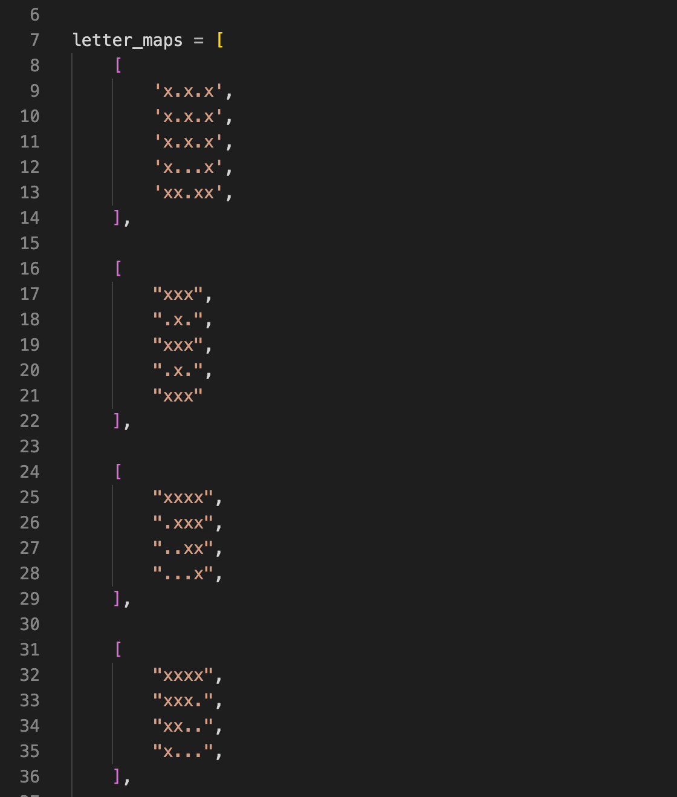
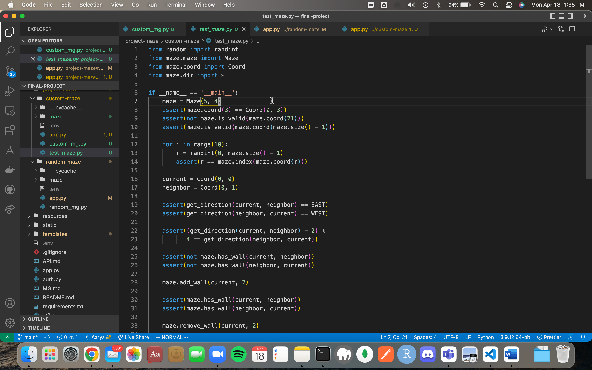

# Maze Generators

We have two maze generators called 'Custom Maze Generator' and 'Random Maze Generator'. Earlier the 'Custom Maze Generator' was called 'Letter Maze Generator' (if you spot this on any documentation), but we extended our class into a more dynamic version of itself and renamed is Custom Maze Generator! Both our maze generators share modules defined in the 'maze' directory. We have copied this directory into both of our maze generator's directories. This package contains the modules 'ccord.py', 'dir.py', 'dset.py', 'maze.py' and 'mg.py' which are at the bottom of this page. The next section will explain our maze generators.

## Custom Maze Generator

**Path**: `project-maze/custom-maze/`

- The custom maze generator creates a maze using a pattern or 'letter map'. The letter map is an array of strings where each string represents one row of the maze and each character of the string represents the particular column of the maze. The string contains either a '.' or a 'x'. A 'x' means that the position belongs to the boundary of the letter, but a dot means that there is blank space. We have several predefined letter map patterns as you can see in the following screenshot:

Therefore, the dots represent blank space and the x's represent the boundary of the shape to trace out. The maze creates walls in the positions labelled as x while leaving the position with dots empty.

The following modification allows us to create different variations with the same letter pattern: Our patterns can have arbitary height and width. We scale the maze up to a 7x7 maze by filling the rest of the space with empty space. Our class contains a 'offset' variable in both directions (x and y) which is picked randomly, so that the full width and height of the maze is as required. Using this offset and letter pattern, the create() function builds a custom maze scaled up to the required dimensions.

The way our create function generates this maze is that, we iterate over the letter map array and at every 'x', we add a wall to that cell in any of the 4 directions where there is a valid cell in the full-maze and there is no adjacent 'x' in the letter map. That is so we outline the boundary of the shape but not fill in.

For example, if the letter pattern had a x in position (0,0), we would add a WEST side wall if there was an empty column before column 0 of the inner-maze and we would add a NORTH side wall if there was an empty row above the inner-maze, in the full-sized maze.

## Random Maze Generator

**Path**: `project-maze/random-maze/`

The random maze generator class works on a Union-rank algorithm which uses a Disjoint set data structure, implemented in the maze/dset.py file. The union-set algorithm is used for cycle detection in our random maze.

The RandomMazeGenrator class which is a subclass of the MazeGenerator creates a maze by breaking random walls until all cells are connected to each other. We partition the grid into single-cell sets. As we join any two cells by removing their walls, the cells merge into a bigger set. When all the cells are merged together, we have successfully finished the algorithm. This function ensures that the maze will be solvable and every cell has a path to every other cell. In addition to that, we create 4 random exits on all 4 sides of the maze.

As an addition to this class we now have a function called `expandIntoLargerMaze` in the file `project-maze/random-maze/random_mg.py` that allows us to expand a maze into a larger maze by filling in the outer rows and columns with blank space evenly on all sides of the inner-maze.

## Package: maze

### maze

- coord.py/Coord
  - A class to represent coordinates or positions in the maze by a row and column
- dir.py/dir_vec_arr: contains a fixed array of 2-dimensional tuples with useful property:
  - The values in this array represent the direction vectors for each of the four directions that the user can move in through the maze.
  - We strategically set the array-index of a direction to the number that is used to encode the cell. The i-th index of the array corresponds with the direction (North/South/East/West) which encodes the i-th bit of the cell in the maze. _For example_, if a cell has a north wall it might have a value of `0b1000`, which is the hex digit 8. So, the North bit is the third bit of this number. Therefore, NORTH is also the third member of the array. If we know which index of the array the direction is in, we can find out how to encode a cell by simply doing `1 << i` for the index i.
  - The actual numbers in the tuple, `(dx,dy)` represent the value that when added to a cell with coordinate `(x,y)` equals to the coordinate `(x+dx,y+dy)` of the new cell, when we take one step in the given DIR (index of the array tells the direction). For example, we are at coord (0,0) and we need to take a step in the EAST direction. EAST is the second element of the array and is equal to (1, 0). So the change in x-direction is 1 and the change in y-direction is 0. The new coordinate after moving 1 cell EAST is `(0,0) + (1,0) = (1,0)`.
- dir.py/get_direction(first,second): A function that accepts two coords and calculates the direction that the second coord is in from the first. The direction will be normalised to a unit value. Assume we only move in 4 directions, N-E-S-W.
- maze.py/Maze
  - A maze class to represent a single maze instance.
  - A maze stores a list of cells. The values of the cell correspond to the walls the cell has i.e. if the 1st element of the list is 0b1000, the cell #1 i.e. the cell at (1,0) has a wall in the North side.
  - The maze also stores the no. of rows and cols as the 'height' and 'width' data member.
  - The list index is mapped to the 2d coord using the bijective function `index(row,col) = row * width + col`, and vice versa: `coord(index) --> (index // width, index % width)`.
  - The maze provides functions to add and remove walls from a cell identified by a coordinate (row, column). The class will internally update the encoding of the cell in the array to match with the state of the maze. There are several other functions that are useful, such as the `is_valid` function which checks if a coord is contained in the maze.
  - The encode function can convert the array into an encoded form, that is used by the backend to send as a response.
- mg.py/MazeGenerator:
  - Base class for maze generators.
  - creates a maze instance in the constructor
  - all subclasses override the create() function which returns a maze

Testing:

We have a test_maze.py file to test the maze and test conversion functions for 1d to 2d indexing of cells.

