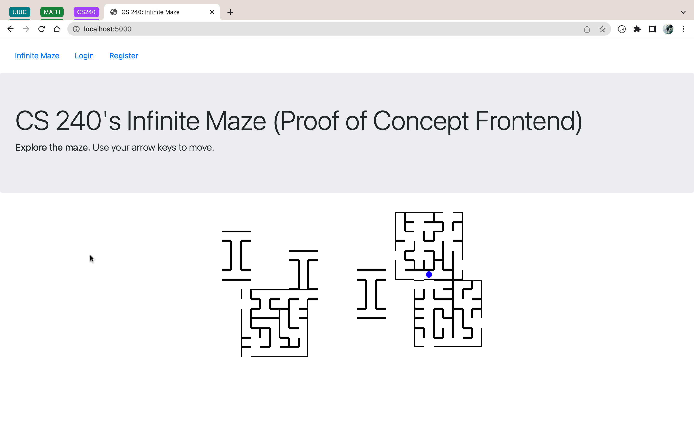

# sp22_cs240_aaryab2-atanwar2_aaryab2-atanwar2



Quick Links

- Read about our API Here: [API.md](API.md)
- Read about our Maaze Generators Here: [MG.md](MG.md)

## Todo

- persistence
- footprints
- non 7x7 grid
- colors
- blocks light up when crossed
- multiple users

## How to start program

Windows

- start and login to WSL
- download the repo: `git clone https://github.com/cs240-illinois/sp22_cs240_aaryab2-atanwar2_aaryab2-atanwar2 final-project`
- go to the directory: `cd final-project`
- install python3
- install mongodb

```{}
sudo apt update && sudo apt-get install mongodb
```

Init db:

```{}
mkdir /data/db
sudo chown -R `id -un` data/db
```

Start mongodb:`mongod`

- Install the required python libraries with pip: `pip install -r requirements.txt`
- Now start the flask app (new terminal): `flask run`
- Start the microservices (new terminal for each):
  - `cd project-maze/letter-maze/ && flask run`
  - `cd project-maze/random-maze/ && flask run`

Local Configurations

- Set the environment variables in the following files:
  - Add the line `FLASK_RUN_PORT=24000` to project-maze/random-maze/.env
  - Add the line `FLASK_RUN_PORT=24001` to project-maze/letter-maze/.env
  - Add the line `SECRET_KEY=<Random Bytes>` to project-maze/.env, where the &lt;Random Bytes&gt; can be any string of bytes, used to initialise a Flask Session.
